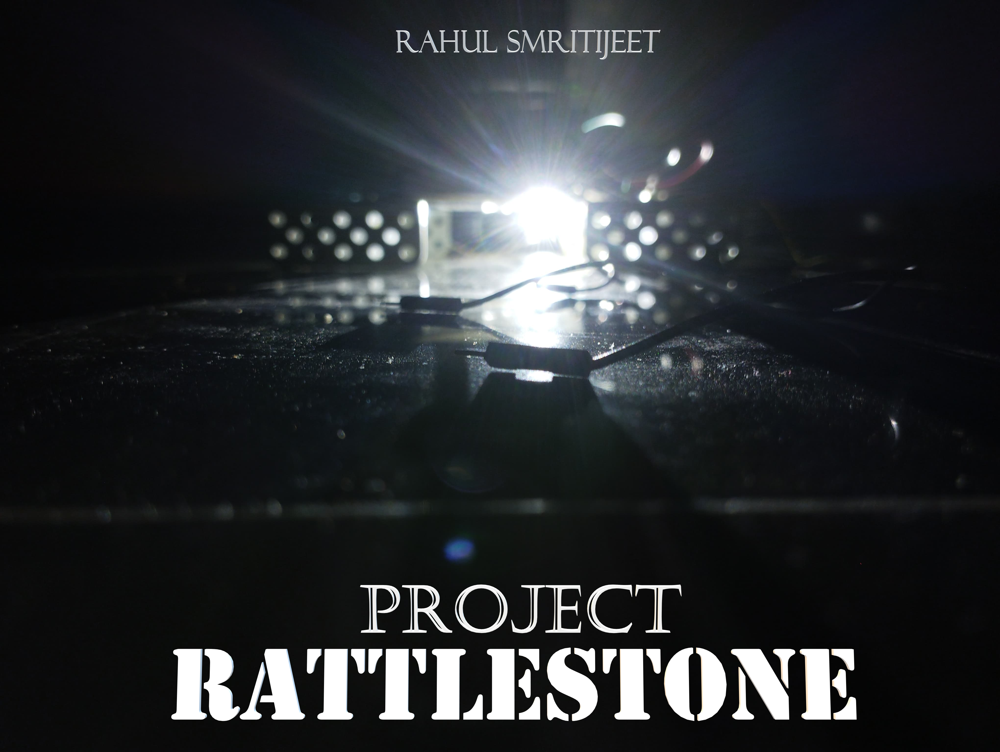

# 🌍 Rattlestone: The Rural Climate Vigilante 🚨

> A scalable, low-cost weather station prototype for detecting **illegal carbon emissions** in rural industrial zones — powered by **ESP32 NodeMCU** or **Arduino Uno Rev3**.

---

## 🧠 Key Features

- ✅ **MQ135 Air Quality Sensor** (CO₂, NH₃, smoke, etc.)
- 🌡️ **DHT11 Sensor** for Temperature & Humidity
- 📺 **16x2 I2C LCD Display** for live readout
- 🌐 **Wi-Fi Dashboard** via ESP32 Web Server
- 🔁 Dual support: **ESP32 NodeMCU** & **Arduino Uno Rev3**
- 🛠️ Modular, ATL-lab friendly & easily replicable
- 🧾 Ideal for **Smart City**, **SDG 13**, **SDG 11**, and **School Projects**

---

## 🛠️ Hardware Components

| Component                | Purpose                              |
|--------------------------|--------------------------------------|
| ESP32 NodeMCU            | Wi-Fi-enabled controller   (recommended)          |
| Arduino Uno Rev3         | Alternate microcontroller            |
| MQ135 Air Quality Sensor | Detects harmful gases               |
| DHT11 Sensor             | Measures temperature & humidity      |
| LCD 16x2 with I2C        | Displays live data                   |
| Jumper Wires + Breadboard| Easy prototyping setup               |

---

## ⚙️ Versions Available

### 🔹 ESP32 Version

- Built-in Wi-Fi
- Local browser-based dashboard
- Ideal for real-time wireless monitoring

**ESP32 Wiring:**

| Component        | ESP32 Pin       | Description                         |
|------------------|------------------|-------------------------------------|
| **MQ135**        | `D35`            | Analog input from MQ135 (AO pin)    |
| **DHT11**        | `D4`             | Digital input for temp/humidity     |
| **LCD I2C**      | `SDA → D21`      | I2C Data line                        |
|                  | `SCL → D22`      | I2C Clock line                       |
| **VCC**          | `3V3` or `VIN`   | Use based on your module's voltage  |
| **GND**          | `GND`            | Common ground                       |

> ⚠️ *If your LCD doesn't display, switch VCC from 3V3 to VIN (5V). Some LCDs need 5V.*

---

### 🔹 Arduino Uno Version

- Offline, LCD-only monitoring
- Great for standalone usage without Wi-Fi

**Arduino Uno Wiring:**

| Component        | Arduino Pin     | Description                         |
|------------------|------------------|-------------------------------------|
| **MQ135**        | `A0`             | Analog input from MQ135             |
| **DHT11**        | `D4`             | Digital input                       |
| **LCD I2C**      | `SDA → A4`       | I2C Data line (default on Uno)      |
|                  | `SCL → A5`       | I2C Clock line                      |
| **VCC**          | `5V`             | Power line for sensors and LCD      |
| **GND**          | `GND`            | Ground line                         |

---

## 🧪 How to Use

1. Clone/download this repository.
2. Select your version:
   - `ESP32/Rattlestone_ESP32.ino`
   - `ArduinoUno/Rattlestone_Uno.ino`
3. Make connections as per your board.
4. Upload code using Arduino IDE.
5. View data on:
   - LCD (both versions)
   - Browser dashboard (ESP32 only)

---

## 🌐 Web Dashboard (ESP32 Only)

- Open Serial Monitor after upload to find IP.
- Enter IP in browser (same Wi-Fi).
- Auto-refreshing UI displays:
  - Air Quality Value
  - Status (GOOD / BAD)
  - Temperature (°C)
  - Humidity (%)

---

## 📷 Project Glimpse

---

## 💡 Use Cases

- 🌍 Track emissions in unregulated rural factories
- 🧪 ATL Smart City / SDG 13 & 11 competitions
- 🛰️ Prototype for decentralized air monitoring
- 🏫 School innovation expos and science fairs

---

## 🔧 Future Scope

- 📸 ESP32-CAM integration for visual records
- ☁️ Firebase / Google Sheets cloud logging
- 🔊 Buzzer alerts for dangerous thresholds
- 🤖 Mountable on mobile rovers for site scanning

---

## 👨‍💻 Built By

**[Rahul Smritijeet](https://github.com/rahulsmritijeet)**  
> *“Pure innovation. Real. Raw. Rattlestone.”*

---

## 📄 License

**MIT License** — Use it, remix it, just don't greenwash it.
